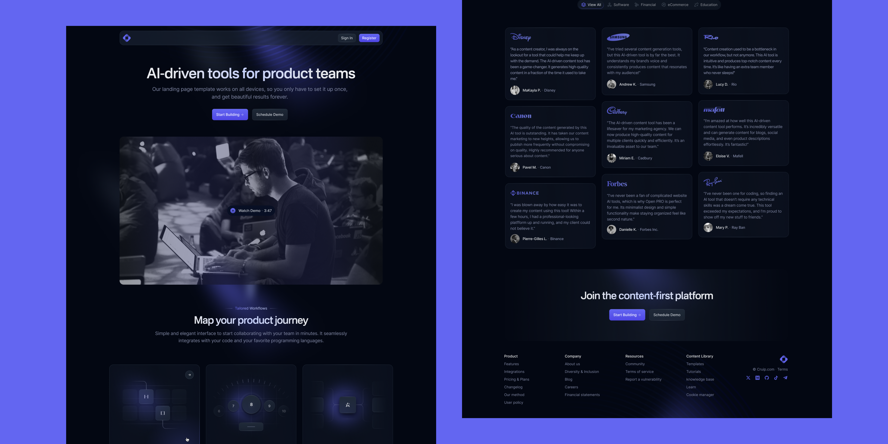

# Open React / Next.js Landing Page (Enhanced)

> An enhanced version of the original **Open React / Next.js Landing Page** template by **Cruip**, updated with modern dependencies, code refactoring, reusable styling utilities, and various improvements for production-ready development.



## 🚀 Live Demo

**Demo:** https://open-react-enhanced.vercel.app

**GitHub Repository:** https://github.com/basitdev44/open-react-enhanced

---

## 📖 Overview

This project is based on the **Open React / Next.js Landing Page** template by **Cruip**. It has been modernized and refactored to improve maintainability, browser compatibility, and developer experience while preserving the original design.

The goal of this repository is to provide a clean, production-ready starter for SaaS products, startups, AI products, agencies, and modern business websites.

---

## ✨ Enhancements

Compared to the original template, this version includes:

- ✅ Updated project dependencies
- ✅ Improved compatibility with the latest Next.js and React versions
- ✅ Refactored reusable components
- ✅ Replaced complex Tailwind CSS arbitrary values with reusable CSS utility classes
- ✅ Centralized reusable visual effects into shared CSS
- ✅ Improved code readability and maintainability
- ✅ Fixed browser rendering issues for CSS masks and gradients
- ✅ Optimized component styling
- ✅ Improved project structure and code organization
- ✅ General bug fixes and code cleanup

Additional improvements and features will continue to be added over time.

---

## 🛠 Tech Stack

- Next.js
- React
- TypeScript
- Tailwind CSS v4
- App Router
- ESLint

---

## 📦 Getting Started

Clone the repository:

```bash
git clone https://github.com/basitdev44/open-react-enhanced.git
```

Navigate to the project:

```bash
cd open-react-enhanced
```

Install dependencies:

```bash
npm install
```

Run the development server:

```bash
npm run dev
```

Open your browser:

```
http://localhost:3000
```

---

## 📁 Project Structure

```
app/
components/
public/
styles/
utils/
```

---

## 🎨 Styling Improvements

This project has been refactored to minimize repeated Tailwind CSS arbitrary values by extracting reusable visual effects into shared utility classes.

Current reusable effects include:

- Generic gradient borders
- Indigo gradient borders
- Shared hover background animations
- Reusable backdrop blur effects
- Common button styling utilities

This approach improves readability, maintainability, and scalability across the project.

---

## 📈 Roadmap

Planned improvements include:

- Additional landing page sections
- Dark/Light mode support
- Accessibility enhancements
- Animation improvements
- More reusable UI components
- Performance optimizations
- Additional customization options

---

## 🙌 Credits

This project is based on the **Open React / Next.js Landing Page** template created by **Cruip**.

**Original Repository**

https://github.com/cruip/open-react-template

**Official Website**

https://cruip.com/

This repository contains additional enhancements, refactoring, maintenance, compatibility updates, and ongoing improvements by **Muhammad Basit**.

---

## 📄 License

This project follows the same **GPL-3.0 License** as the original repository.

Please refer to the original project for complete licensing details.

---

## 👨‍💻 Maintained By

**Muhammad Basit**

🌐 Portfolio: https://devcoder.space

💼 LinkedIn: https://www.linkedin.com/in/basitdevcoder/

🐙 GitHub: https://github.com/basitdev44?tab=repositories

---

If you find this project useful, please consider giving it a ⭐ on GitHub.
